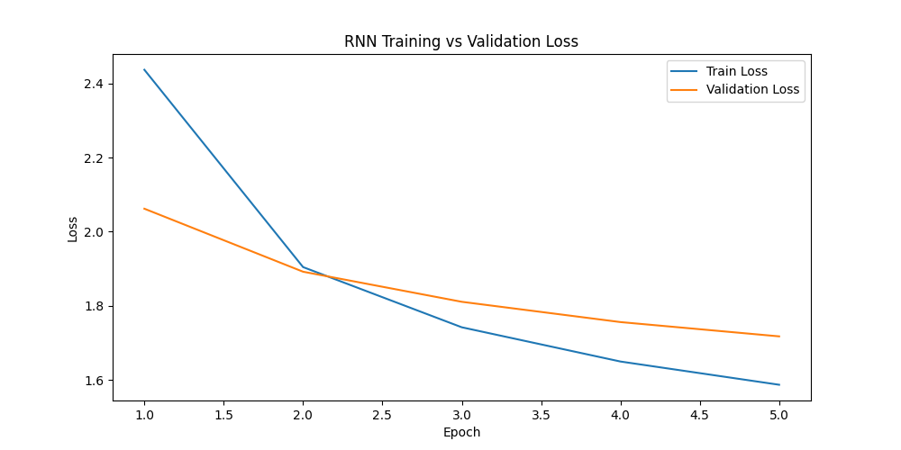
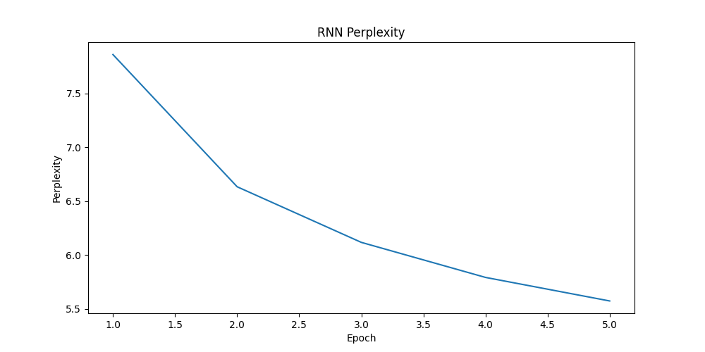
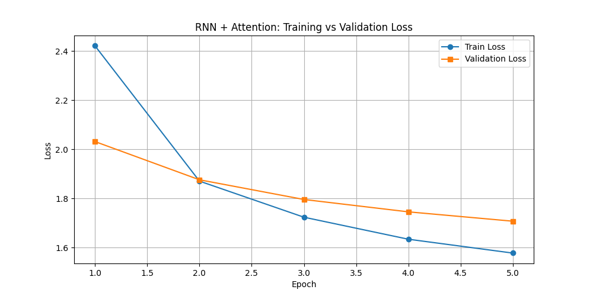
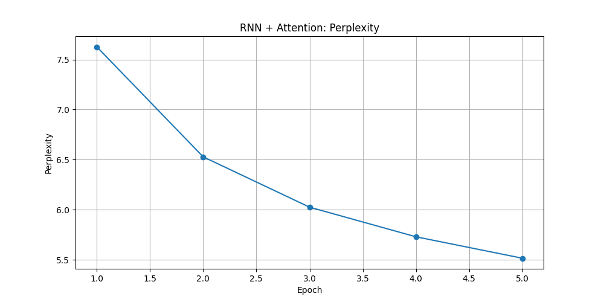

# Evolution of Sequence Models on Tiny Shakespeare  
*A Comparative Study: RNN vs RNN + Attention*

---

## 1. Motivation

This project investigates the evolution of sequence modeling architectures through controlled experiments on the Tiny Shakespeare dataset.

We progressively implemented:

1. LSTM-based language model  
2. LSTM + Additive Attention (Bahdanau-style)

The objective is to analyze:

- Whether additive attention improves character-level language modeling
- The computational trade-offs introduced by attention
- Whether recurrence is truly the bottleneck

This mirrors the historical transition from RNN-based models to attention-based architectures.

---

## 2. Dataset

**Tiny Shakespeare**

- ~1.1M characters
- Character-level modeling
- Vocabulary size: 65
- 90% training / 10% validation split

Language modeling objective:

\[
P(x_t | x_{<t})
\]

Targets are created by shifting the input sequence by one character.

---

## 3. Experimental Setup

Both models were trained under identical hyperparameters:

- Embedding dimension: 128  
- Hidden dimension: 256  
- Block size: 128  
- Batch size: 32  
- Optimizer: Adam  
- Learning rate: 3e-4  
- Steps per epoch: 500  
- Epochs: 5  
- Loss: CrossEntropy  
- Evaluation metric: Perplexity = exp(validation loss)

---

## 4. Model 1 — LSTM Language Model

Architecture:

Embedding → LSTM → Linear Projection

Characteristics:

- Sequential recurrence
- Gated memory (LSTM)
- Fixed-size hidden state bottleneck

### Training Metrics

| Epoch | Train Loss | Val Loss | Perplexity |
|-------|------------|----------|------------|
| 1 | 2.4368 | 2.0621 | 7.86 |
| 2 | 1.9047 | 1.8922 | 6.63 |
| 3 | 1.7424 | 1.8111 | 6.12 |
| 4 | 1.6500 | 1.7564 | 5.79 |
| 5 | 1.5874 | 1.7179 | 5.57 |

### Observations

- Strong and stable convergence
- Good modeling of short-range character dependencies
- Perplexity steadily decreased across epochs
- No severe overfitting observed

---

## 5. Model 2 — LSTM + Additive Attention

Based on:

Bahdanau et al., *Neural Machine Translation by Jointly Learning to Align and Translate* (2014)

Architecture:

Embedding → LSTM → Additive Attention → Linear Projection

Causal masking was applied to prevent future token leakage:

\[
P(x_t | x_{<t})
\]

### Training Metrics

| Epoch | Train Loss | Val Loss | Perplexity |
|-------|------------|----------|------------|
| 1 | 2.4212 | 2.0317 | 7.63 |
| 2 | 1.8708 | 1.8762 | 6.53 |
| 3 | 1.7239 | 1.7960 | 6.03 |
| 4 | 1.6343 | 1.7457 | 5.73 |
| 5 | 1.5779 | 1.7076 | 5.52 |

---

## 6. Comparative Analysis

### Performance Comparison (Final Epoch)

| Model | Val Loss | Perplexity |
|--------|----------|------------|
| LSTM | 1.7179 | 5.57 |
| LSTM + Attention | 1.7076 | 5.52 |

### Key Findings

1. Attention slightly improved final validation loss.
2. Performance gains were modest.
3. Training remained stable after introducing causal masking.
4. No dramatic improvement was observed.

---

## 7. Interpretation

### Why Was Improvement Limited?

1. Character-level modeling is dominated by short-range dependencies.
2. LSTM gating already captures local structure effectively.
3. Sequence length (128) may not be long enough to expose recurrence bottlenecks.
4. Additive attention increases parameter complexity and optimization difficulty.

### Important Insight

Attention does not automatically outperform recurrence.  
Its advantages become more pronounced in:

- Long-context modeling
- Machine translation
- Larger-scale datasets

This motivates transitioning to fully attention-based architectures.

---

## 8. Computational Observations

- Additive attention introduces O(T²) complexity.
- Training time increased compared to plain LSTM.
- Causal masking was essential to prevent information leakage.

---

## 9. Key Lessons Learned

1. Controlled experiments require identical hyperparameters.
2. Architectural improvements must be evaluated fairly.
3. Attention increases flexibility but also computational cost.
4. RNN remains a strong baseline in small-scale character modeling.

---

## 10. Next Step

Implement Decoder-Only Transformer:

- Multi-head self-attention
- Positional embeddings
- Parallelized attention
- Removal of recurrence

Goal: Determine whether fully attention-based modeling provides clearer benefits.
